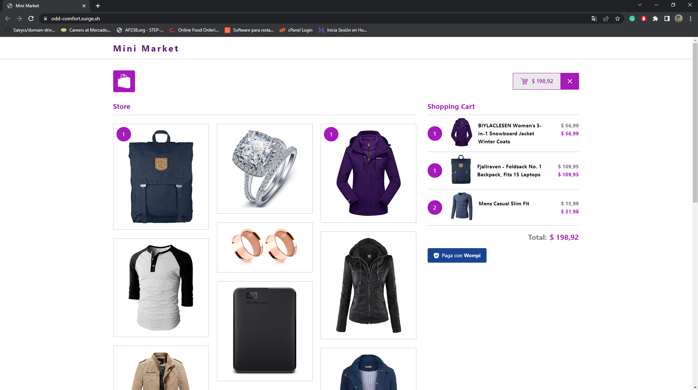

# Mini-Market - Shopping Cart Project

Mini-Market is a small web application project built with React JS that provides a simple and intuitive shopping cart functionality for a mini-market application.

A live version of the application is available at [https://odd-comfort.surge.sh/](https://odd-comfort.surge.sh/).

The project was built using the following technologies:

- Vite (Build Tool)
- TypeScript
- Redux Toolkit (State Management)
- Vitest (Unit Testing)
- React Testing Library (Unit Testing)
- CSS
- GitHub Actions (CI/CD)
- Surge.sh (Hosting)

## Features
- View a list of products available in the mini-market
- See product details, including name, price, and description
- Add products to the shopping cart
- Increment and decrement product quantities in the shopping cart
- Remove products from the shopping cart
- Calculate the total price of the products in the shopping cart
- Mobile device compatibility

## Screenshots




## Cloning the Repository

To clone the repository, run the following command:

```
git clone https://github.com/EfrainRodriguez/mini-market.git
```

## Installation

To install the project dependencies, navigate to the project folder and run:

```
yarn
```

## Local Development

To start the development server, run the following command:

```
yarn dev
```

The application will be accessible at `http://localhost:5173`.

## Running Tests

To execute the tests, run the following command:

```
yarn test
```

This will run the test suite using Vitest and React Testing Library.

## Build and Deploy

The project includes a GitHub Actions pipeline that automatically builds and deploys the application using the surge.sh service. The deployment pipeline is triggered on every push to the master branch.

The yaml file for the pipeline can be found at [ /.github/workflows/deploy.yaml](/.github/workflows/build-and-deploy.yaml).

You can access the live version of the application deployed at [https://odd-comfort.surge.sh/](https://odd-comfort.surge.sh/).

If you have any questions or need assistance, please don't hesitate to reach out.

Thanks for your time and consideration!